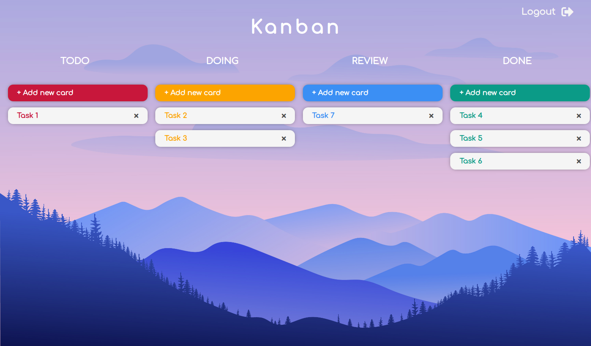

# Kanban



## Introduction

Kanban is a visual system for managing work and tasks as they move through a process.
It's really easy to use, drag and drop the tasks when they change it's status to the correct column.
Just create an account and start working!

[Here you can run the deployed project](https://diana-moreno.github.io/kanban)

## Technical Description

Frontend: React (javascript), CSS-SASS, BEM

Backend: Express (Node), Mongoose (MongoDB)

## Usage

**Prerequisites:**

- [Install Node.js](https://nodejs.org/es/) if you haven't yet. Npm is needed but is included with Node.js. (working with node v13.14.0)

- [Install MongoDB](https://docs.mongodb.com/manual/installation/#tutorial-installation).

**Next steps:**

- Download or [clone the repository](https://github.com/diana-moreno/kanban.git).

- Install the dependencies from the following folders:

  - frontend
  - backend/api
  - backend/data
  - backend/utils

  running the command in each one:

  ```shell
  npm i
  ```

- There are two configuration files named ".env.example" in the following folders:

  - frontend
  - api

  Rename the files from ".env.example" to ".env"

**Running:**

- Open 3 terminal windows.

1- Turn your database on and ensure the data base is still on

```shell
sudo systemctl start mongod
sudo systemctl status mongod
```

2- From 'api', run the backend with Node:

➜ api

```shell
node .
```

3- From 'frontend', open the frontend with React:

➜ frontend

```shell
npm run start
```

Now, the database is on, the server is running and the frontend connected to it, you can start playing in the website!
