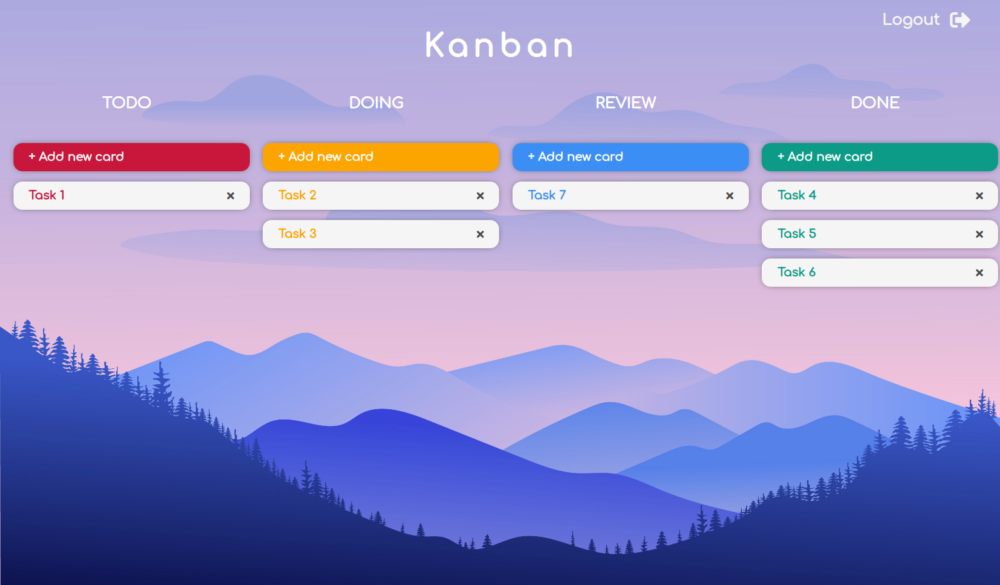

# Kanban



## Introduction

Kanban is a visual system for managing work and tasks as it moves through a process.
It's really easy to use because you only have to drag and drop the tasks when them change the status to the correct column.
Just create an account and start working!

You can run the deployed project here: https://diana-moreno.github.io/kanban

## Technical Description

Frontend: React (javascript), CSS-SASS, BEM

Backend: Express (Node), Mongoose (MongoDB)

## Usage

Your need a private files to run in local, if you want to do it, please, contact me.

**Prerequisites:**

- Install Node.js if you haven't yet (https://nodejs.org/es/). Npm is needed but is included installing Node.js.

- Install MongoDB (https://docs.mongodb.com/manual/installation/#tutorial-installation).

**Next steps:**

- Download or clone the repository in your local (https://github.com/diana-moreno/kanban.git).

- Install dependencies from the following folders:
  - tasks-api
  - tasks-app
  - tasks-data
  - tasks-utils

  running the command in each one:
  ```
  npm i
  ```

**Running:**

- You need to keep opened 3 terminal windows at the same time.

1- From the folder you have installed the data base MongoDB. Enter in the forlder, and inside of 'bin', run the following command. This keeps your data base on.

➜  bin
  ```
  mongod --dbpath ../data
  ```

2- From 'tasks-api' you must run the backend with Node:

➜  tasks-api
  ```
  node .
  ```

3- From 'tasks-app' your must open the frontend with React:

➜  tasks-app
  ```
  npm run start
  ```

Now, the data base is on, the server is running and the frontend connected to backend, you can start playing in the website!
